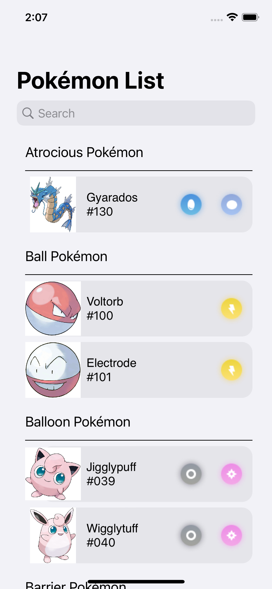

# SIMPLE POKEDEX

### This application developed for ios 15 allows you to list pokemon and see the pokemon in more detail using two different apis.

## Structure
> The Model-view-view-model (MVVM) architecture pattern was used for this project.
- Resourses
- Extensions
- Modules
  - PokemonDetails
    - Services
    - Models
    - ViewModels
    - Views
  - PokemonList
    - Services
    - Models
    - ViewModels
    - Views
- GraphQL
- PokedexTest   

## Installations
> PokeChallenge requires 
> - Xcode 13.*
> - iOS 15.0
### Clone the project
```
git clone https://github.com/edsonlipa/Ravn-Challenge-V3-Edson-Lipa.git
```
## Images



## Technologies used

* Swift 5
* GraphQL API - Provided data with mutations
* Apollo Client - It allows you to execute queries and mutations against a GraphQL server
* Kingfisher - Kingfisher is a powerful, pure-Swift library for downloading and caching images from the web

## APIs Used
* List Pokemons[GraphQL Api](https://wayfair.github.io/dociql/)
* Detail Pokemons[Rest Api](https://pokeapi.co/docs/v2) 